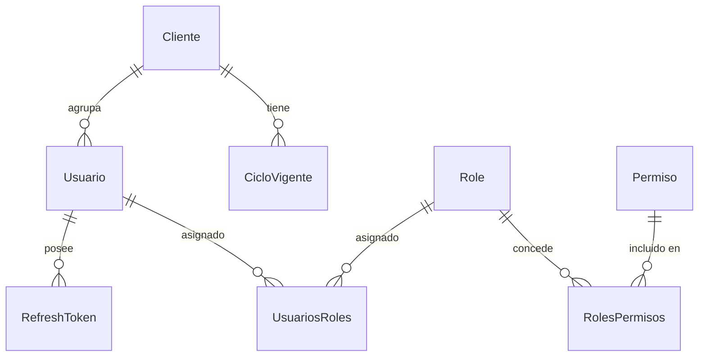
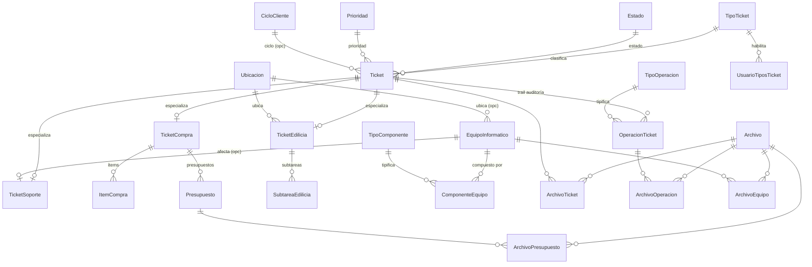
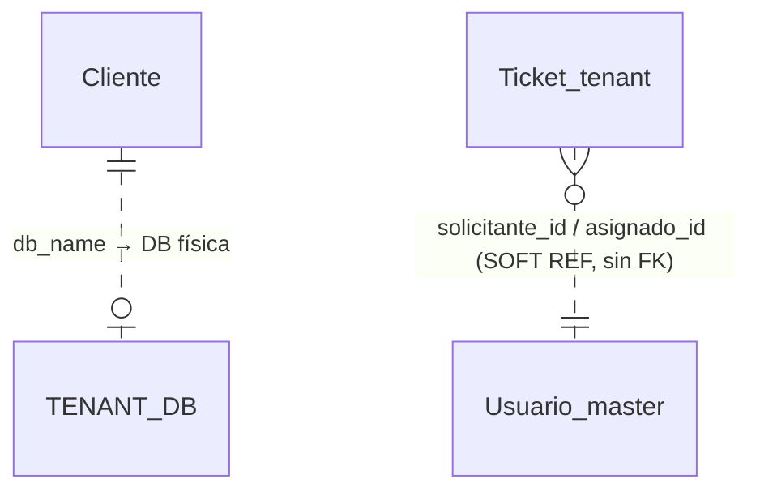

# DER — Modelo de Datos (Soporte)

> Sistema multi-tenant con arquitectura **database-per-tenant**: la identidad global,
> el tenancy y el RBAC viven en la DB **MASTER**; el negocio vive en una DB **TENANT**
> por cada cliente. Las referencias del tenant a usuarios son *soft refs* (sin FK
> cross-DB), porque son bases de datos físicamente separadas.
>
> Fuente de verdad: `backend/prisma_master/schema.prisma` y `backend/prisma_tenant/schema.prisma`.
> **31 entidades** (8 master + 23 tenant).

---

## 🗄️ MASTER — identidad, tenancy y RBAC

`UsuariosRoles` (usuario↔role) y `RolesPermisos` (role↔permiso) son las tablas puente N:M del RBAC.

| Entidad | Tabla | Rol |
|---|---|---|
| `Cliente` | `clientes` | Organización/tenant. `db_name` enruta a su DB física |
| `CicloVigente` | `ciclos_vigentes` | Período de gestión vigente del cliente |
| `Usuario` | `usuarios` | Identidad global cross-tenant. Se valida en el login |
| `RefreshToken` | `refresh_tokens` | Refresh tokens persistidos (revocables) |
| `Role` | `roles` | Roles del RBAC (ej. ADMIN, SOPORTE_IT) |
| `Permiso` | `permisos` | Permisos atómicos (ej. `ticket:editar`) |
| `RolesPermisos` | `roles_permisos` | Puente N:M role↔permiso |
| `UsuariosRoles` | `usuarios_roles` | Puente N:M usuario↔role |

---

## 🏢 TENANT — negocio (una DB por cliente)

### Catálogos
| Entidad | Tabla |
|---|---|
| `Estado` | `estados` |
| `Prioridad` | `prioridades` |
| `TipoTicket` | `tipos_ticket` |
| `TipoOperacion` | `tipo_operacion` |
| `CicloCliente` | `ciclos_cliente` |
| `TipoComponente` | `tipos_componente` |

### Tickets (core)
| Entidad | Tabla |
|---|---|
| `Ticket` | `tickets` |
| `OperacionTicket` | `operaciones_ticket` (trail de auditoría) |
| `UsuarioTiposTicket` | `usuario_tipos_ticket` |

### Compras
| Entidad | Tabla |
|---|---|
| `TicketCompra` | `ticket_compra` |
| `ItemCompra` | `items_compra` |
| `Presupuesto` | `presupuestos` |

### Reparaciones / Edilicia
| Entidad | Tabla |
|---|---|
| `Ubicacion` | `ubicaciones` |
| `TicketEdilicia` | `ticket_edilicia` |
| `SubtareaEdilicia` | `subtareas_edilicia` |

### Equipos
| Entidad | Tabla |
|---|---|
| `EquipoInformatico` | `equipos_informaticos` |
| `ComponenteEquipo` | `componentes_equipo` |
| `TicketSoporte` | `ticket_soporte` |

### Archivos (storage adjunto)
| Entidad | Tabla |
|---|---|
| `Archivo` | `archivos` |
| `ArchivoTicket` | `archivos_ticket` |
| `ArchivoOperacion` | `archivos_operacion` |
| `ArchivoPresupuesto` | `archivos_presupuesto` |
| `ArchivoEquipo` | `archivos_equipo` |

---

## 🔗 El puente entre MASTER y TENANT (clave del diseño)

- `Ticket.solicitante_id` y `Ticket.asignado_id` apuntan a `master.usuarios` pero **NO son FK** — son *soft refs*, porque son bases de datos separadas.
- `Cliente.db_name` (master) es lo que enruta cada request al tenant correcto (el `TenantGuard` lo resuelve desde el `cliente_id` del JWT).

---

## Patrón estructural: los tres flujos

Los tres flujos de negocio — **Compras**, **Edilicia/Reparaciones** y **Soporte (Equipos)** — son
**especializaciones de `Ticket`** (relación 1:0..1). `Ticket` es la tabla base con los campos
comunes (título, estado, prioridad, tipo, fechas, auditoría) y cada `Ticket{Compra,Edilicia,Soporte}`
agrega los campos propios de su flujo. Es el modelo que da nombre al change de backend
`modelo-datos-tres-flujos`.
